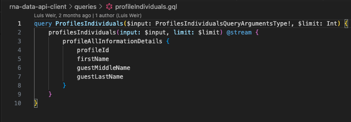
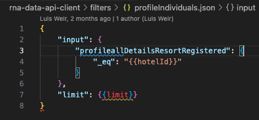
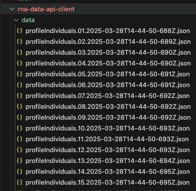
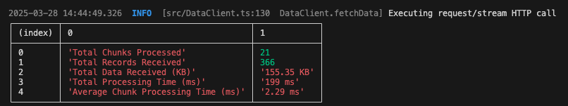

# R&A Data APIs Use Cases

- [0 Introduction](#0-introduction)
- [1 Get Token](#1-get-token)
- [2 Fetch Profiles changed in the last 3 days](#2-fetch-profiles)
- [3 Fetch Reservations changed in the last 3 days](#3-fetch-reservations)
- [4 Fetch Transaction details for these reservations](#4-fetch-transaction-details)
- [5 Fetch Using Client](#5-fetch-using-client)

## 0 Introduction

In this bootcamp, we will go through the usage of R&A Data APIs to fetch data using streaming technologies from your R&A platform.

We will be using a client [published in GitHub](https://github.com/luisweir/rna-data-api-client) developed by Luis Weir (it is only for demonstration purpose and not an Oracle official R&A Data API client). This client connects to OHIP and executes the queries you define. The output will be stored locally in your laptop as text files.

## 1 Get Token

This is required to access Oracle Hospitality APIs.

To obtain a token include the following headers:

- A Basic authentication header using the base64 hash of your Client ID and Client Secret in the format `ClientID:ClientSecret` - base64 encoded to the Basic Access Authorization standard
- Your application key in the `x-app-key` header

- Body parameters:
  | form key | form value |
  | ------------ | ------------------------------ |
  | `grant_type` | `client_credentials` |
  | `scope` | `urn:opc:hgbu:ws:__myscopes__` |

## 2 Fetch Profiles

Here you will be fetching the profiles you've modified during the OHIP Lab and store them locally.

For this, you'll use the Profile-Individuals Subject Area API and filter by the property you've been using as well as by their updated date. You can modify the input provided to change the requested data points.

If you're using the [sample GraphQL client](https://github.com/luisweir/rna-data-api-client), in folder "queries" there are some sample queries you can leverage. Create your version of the GraphQL query you want to use to fetch your profiles. Under folder "filters", you have also some samples of filter. Create your version to filter profiles changed in the last 3 days of the property you've been using.

#### Input parameters needed:

- `profileallDetailsResortRegistered` (optional)
- `profileallDetailsUpdateDate`

## 3 Fetch Reservations

Here you will be fetching the reservations you've created during the OHIP Lab and store them locally.

For this, you'll use the Booking-Reservation Subject Area API and filter by the property you've been using as well as by their begin and end dates. You can modify the input provided to change the requested data points.

If you're using the [sample GraphQL client](https://github.com/luisweir/rna-data-api-client), in folder "queries" there are some sample queries you can leverage. Create your version of the GraphQL query you want to use to fetch your reservations. Under folder "filters", you have also some samples of filter. Create your version to filter reservations changed in the last 3 days of the property you've been using.

#### Input parameters needed:

- `reservationDetailsResort`
- `reservationDetailsTruncBeginDate`
- `reservationDetailsTruncEndDate`

## 4 Fetch Transaction Details

Here you will be fetching the transactions you've created during the OHIP Lab and store them locally.

For this, you'll use the Financial-TransactionDetails Subject Area API and filter by the property you've been using as well as by their business and transaction dates. You can modify the input provided to change the requested data points.

If you're using the [sample GraphQL client](https://github.com/luisweir/rna-data-api-client), in folder "queries" there are some sample queries you can leverage. Create your version of the GraphQL query you want to use to fetch your transactions. Under folder "filters", you have also some samples of filter. Create your version to filter transactions created in the last 3 days related to your reservations.

#### Input parameters needed:

- `financialtransDetailsResvNameId`
- `financialtransDetailsBusinessdate`
- `financialtransDetailsResort`
- `financialtransDetailsTrxDate`

## 5 Fetch Using Client

This is it demonstrate using a node based client to invoke the R&A Data API and store the response into a file.

Client: [rna-data-api-client](https://github.com/luisweir/rna-data-api-client)

### Pre-Requisites

1. Git
2. Node

### Installing the Client

1. Clone or download the client code

```shell
git clone https://github.com/luisweir/rna-data-api-client
```

2. Install the node dependencies

```shell
cd rna-data-api-client
npm install
```

### FolderStructure

```
rna-data-api-client
├── .env
├── data
│   └──<fetch_response>.json
├── filters
│   └──<filter_name>.json
├── queries
│   └──<query_name>.gql
└── src
```

### Configure

1. Create a .env file if not present already

```shell
touch .env
```

2. Add the required config into .env file
   | Property | Description |
   | -------- | ----------- |
   | `APIGW_URL`| OHIP Gateway URL |
   |`APP_KEY`| OHIP x-app-key |
   |`CLIENT_ID`| client_id to generate OAuth Token for Authentication|
   |`CLIENT_SECRET`| client_secret to generate OAuth Token for Authentication|
   |`ENTERPRISE_ID`| enterprise identifier related to the customer environment|
   |`EXCLUDE_NULL`| Set to true to remove null values from responses|
   |`PLUGIN_NAME`| Specifies which plugin should be used for processing data streams |
   |`QUERY_NAME`| File name for the query to be used while preparing the request|
   |`FILTER_NAME`| File name for the filter conditions to be used while preparing the request |
   |`FILTER_VARS`|Defines dynamic variables for filters. Takes comma separated variables with `key:value` format |
   |`LOGLEVEL`| Defines the log verbosity level (`silly`, `trace`, `debug`, `info`, `warn`, `error`, `fatal`)|
   |`ENABLE_PROXY`| Enable or Disable System Proxy for the request being Sent|

Example:

```shell
APIGW_URL=https://mucu1ua.hospitality-api.us-ashburn-1.ocs.oc-test.com
APP_KEY=****
CLIENT_ID=****
CLIENT_SECRET=****
ENTERPRISE_ID=OCR4ENT
EXCLUDE_NULL=true
PLUGIN_NAME=fileWriter
QUERY_NAME=profileIndividuals
FILTER_NAME=profileIndividuals
FILTER_VARS=hotelId:OHIPSB01,limit:100000
LOGLEVEL=info
ENABLE_PROXY=false
```

3. creating query file

- Insert the query content into the file
- Select the file name in config to run this query
  Example:
  
  

4. Creating filter file

- Insert the filter conditions json into the file
- To make the variables configure give a place holder of the variable name in jinja template format. Example: `{{hotelId}}`
- Select the file name in config to apply this filter conditions along with the query selected
  Example:

  

### Fetch Data

1. After making the necessary configuration changes needed, run the script to fetch the data

```shell
npm start
```

2. If the fileWriter plugin is selected the output of each response chunk is saved into individual json file in the data folder

   

3. Requests Stats like no of records, no of chunks and Time Stats can be seen in the output of the script

Example:


